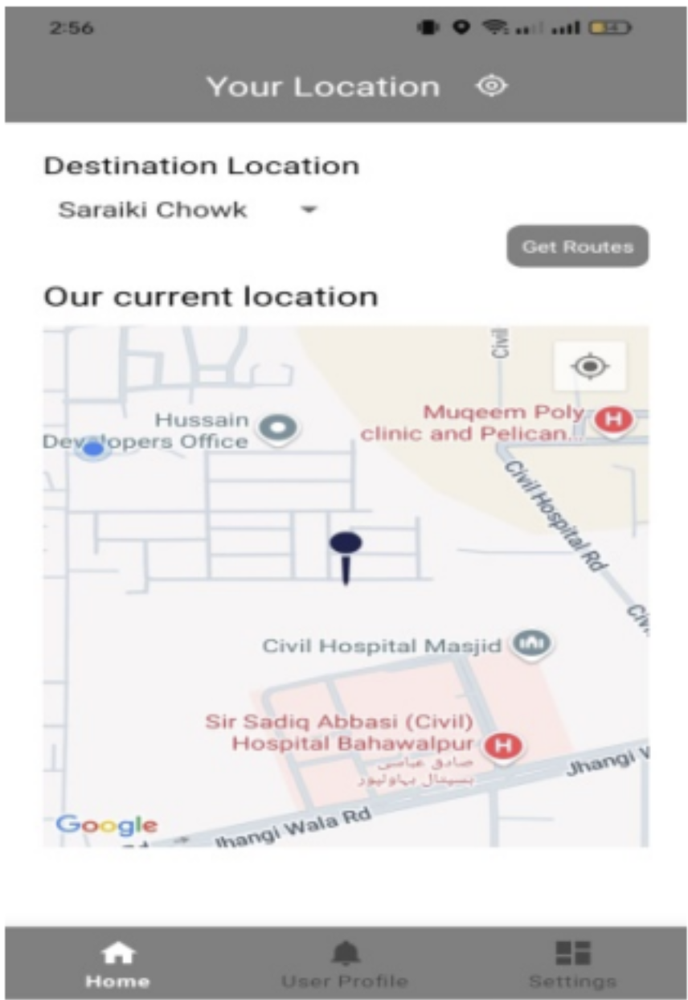
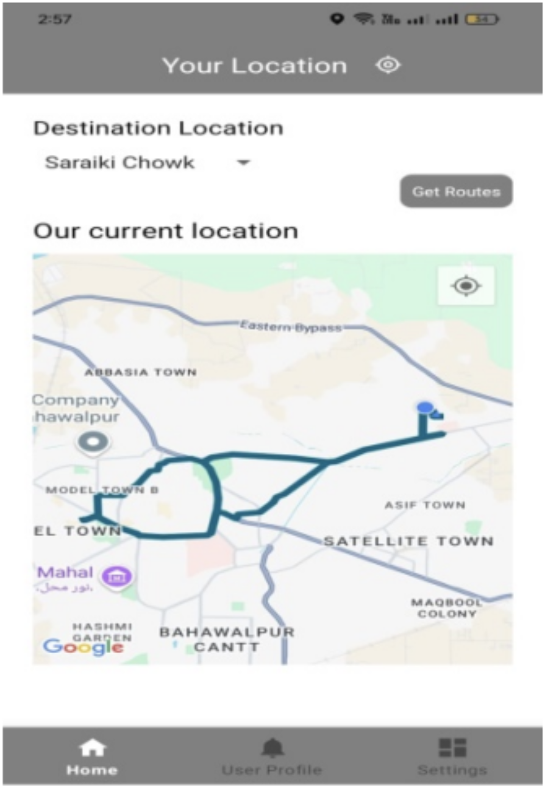
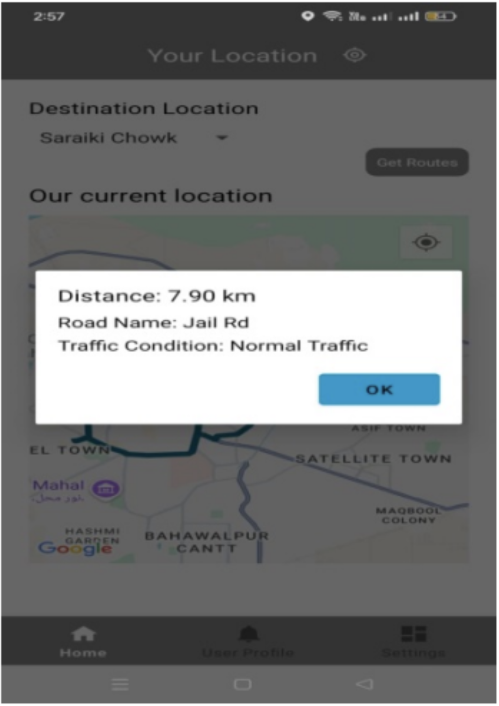

# 🚦 Traffic Sensor App

An Android application that uses device sensors to detect movement patterns and evaluate real-time traffic conditions.

---

## 📱 Overview

The Traffic Sensor App is designed to analyze motion data from smartphone sensors (and external hardware if connected) to estimate traffic conditions. It processes real-time sensor input and provides a simple visual output for traffic evaluation.

---

## 🚀 Features

- Real-time sensor data collection  
- Traffic condition evaluation based on movement patterns  
- Integration with external hardware (PIR sensor / Arduino if used)  
- Lightweight and fast processing  
- Simple and user-friendly interface  

---

## 🛠️ Tech Stack

- Kotlin / Java  
- Android SDK  
- Sensor Manager API  
- Firebase (if used)  
- Arduino Integration (if applicable)  

---

## 🧠 How It Works

1. The app collects motion data using device sensors  
2. Data is processed in real-time  
3. Algorithm evaluates movement intensity  
4. Output is shown as traffic condition status  

---

## 📸 Screenshots

  
  
  

---

## 🎯 Purpose

This project demonstrates how smartphone sensors can be used for real-time data analysis and smart traffic evaluation systems.

---

## ⚙️ Installation

1. Clone this repository  
2. Open in Android Studio  
3. Build and run on physical device  

---

## 📌 Future Improvements

- AI-based traffic prediction  
- GPS integration  
- Cloud-based data storage  
- Improved accuracy using machine learning  

---

## 👨‍💻 Developer

Azka Shahid  
Android Developer  
GitHub: https://github.com/AzkaShahid
